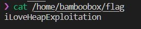

# Exploitation of HITCON-Training-Lab11
[Detail is at here](https://hackmd.io/DSfzC8arSGygYD_yfk5Oog?view#House-of-Force-top-chunk-related)
## Souce code 分析
1. `magic()` 裡面會印出 "/home/bamboobox/flag" 的內容，因此要先建立 "/home/bamboobox/flag"  
    

2. `change_item()` 裡 item name 的長度是由使用者輸入決定的，因此可以造成 overflow

3. `struct box` 裡面有兩個 function pointer `box->hello_message` and `box->goobye_message`, 如果能把 `box->goobye_message` (0x4008b1) 改成 `magic()` 的位址 (0x400d49)，就可以在離開的時候執行 `magic()`

4. 分配適當的大小的 chunk (malloc(0x30)) 可以使此 chunk 剛好與 top chunk 相鄰 (&chunk + 0x30 為 top chunk header)，因此能夠在 `change_item()` 裡面成功 overflow top chunk 的 size field (&chunk + 0x30 + 0x8)

5. 由 (evil_size = dest - old_top - 4*sizeof(long)) 算出要對 `malloc()` 輸入多大的 evil_size，dest 為 `&bamboo`，bamboo 為 `main()` 一開始呼叫 `malloc()` 分配的 chunk

在 gdb 中查看 chunks 能夠得出以下資訊
```
dest = 0x2a0 # &bamboo
old_top = 0x300 - 0x10 # - 0x10 since we want the header of the top chunk
```
呼叫 add(evil_size, "aaaa") 使 `malloc()` return old_top 的位址，接著再次呼叫 add(0x10, p64(magic) * 2) # Cover bamboo->hello_message and bamboo->goodbye_message

這次拿到的 malloc return 的就會是 &bamboo (`main()` 一開始呼叫 `malloc()` 分配的 chunk)， `add(0x10, p64(magic) * 2)` 會把 hello_message, goodby_message 蓋成 magic()
成功拿到一開始填入 "/home/bamboobox/flag" 的內容 'iLoveHeapExploitation'
